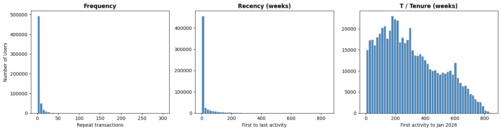
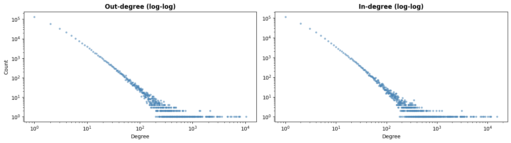
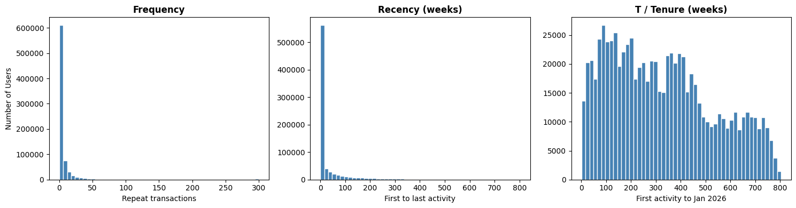
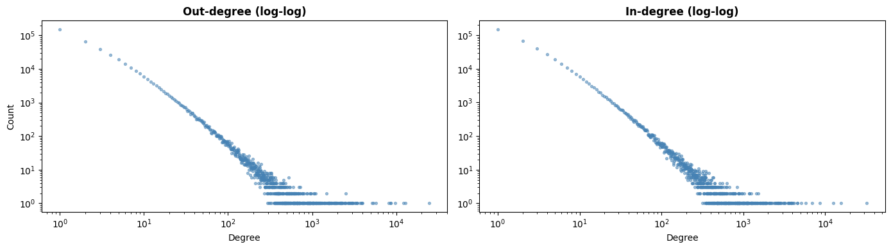
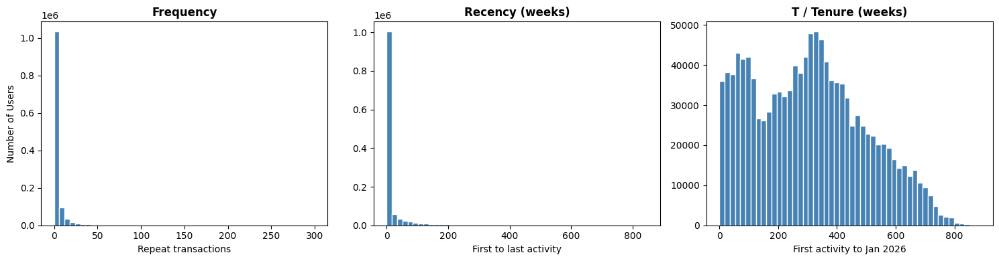
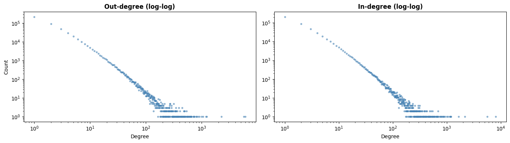

# Reddit User Churn Prediction

## Research Question

Do Reddit users show detectable behavioral shifts in language use and social network activity before they disengage, and does combining NLP-based features with social network features produce meaningfully better churn predictions than either feature type used alone?

## Part 1: r/learnprogramming

**Figure 1.** BG/NBD input variable distributions for r/learnprogramming (N = 117,062 qualifying users).

**Interpretation:** All three distributions are strongly right-skewed. Most users have a frequency of 1 (only one repeat visit after joining) and a recency of 0 weeks (their first and last activity happened within the same week). At the same time, most users have a T of several years, meaning they joined a long time ago but barely came back. Most users posted only a handful of times and then stopped, and this pattern holds across all three subreddits.

**Figure 2.** Log-log degree distribution of the reply network for r/learnprogramming (1,998,645 edges, 369,537 nodes).

**Interpretation:** Both the out-degree (replies sent) and in-degree (replies received) distributions show a roughly linear trend on the log-log scale, which indicates a power-law pattern. In practice this means most users sent or received very few replies, while a small number of users were extremely active in the network. The average out-degree is 6.17 but the median is only 2, which captures this gap well. This uneven structure means most users were fairly peripheral in the network, while a small group of users drove the majority of all reply activity.

## Part 2: r/loseit

**Figure 3.** BG/NBD input variable distributions for r/loseit (N = 175,975 qualifying users).

**Interpretation:** The distributions look very similar to r/learnprogramming: most users have a frequency of 1, a recency of 0 weeks, and a tenure of several years. One difference is that the mean frequency here is 9.46, higher than in r/learnprogramming (6.57), which suggests r/loseit users tend to post somewhat more often on average. This probably reflects that r/loseit users often share weight loss progress updates regularly, so they tend to post more than users in a Q&A-style community. Even so, the overall picture is the same: most users are concentrated at the low end of all three variables.

**Figure 4.** Log-log degree distribution of the reply network for r/loseit (3,550,327 edges, 493,377 nodes).

**Interpretation:** The log-log plot for r/loseit shows the same approximately linear pattern. The network is larger than r/learnprogramming (3.55 million edges vs. 2 million), and the most active replier sent 24,464 replies, about twice the maximum in r/learnprogramming. The mean out-degree is 8.74 with a median of 2, showing the same kind of gap between typical and highly active users. The same skewed shape shows up in both subreddits, which suggests this is just how Reddit reply networks tend to look.

## Part 3: r/depression

**Figure 5.** BG/NBD input variable distributions for r/depression (N = 228,696 qualifying users).

**Interpretation:** The distributions are right-skewed in the same way, but r/depression has a noticeably lower mean frequency (4.41) compared to r/learnprogramming (6.57) and r/loseit (9.46). The mean recency is also shorter at 18.95 weeks. This suggests that r/depression users tend to post for a shorter period and leave sooner. Many users probably post during a difficult time and stop once that period passes.

**Figure 6.** Log-log degree distribution of the reply network for r/depression (2,056,916 edges, 586,867 nodes).

**Interpretation:** The log-log plot again shows an approximately linear trend, consistent with the other two subreddits. One difference worth noting is that only 47.6% of qualifying r/depression users appear in the reply network at all, compared to around 62% in r/learnprogramming and r/loseit. This means a larger share of r/depression users only posted top-level content without ever replying to others. In r/depression, people tend to post to share what they are going through rather than to have back-and-forth conversations, so fewer users end up replying to each other.

## Challenges

One challenge is that it is hard to identify users who deleted their accounts after the data was collected, because their posts still show up under their original usernames in the archive. This means the churn labels for these users may be incorrect.

Another challenge is that a small number of users have negative tenure values, meaning their first activity appears to be after the observation end date. This is most likely a timestamp inconsistency introduced, but the exact cause is unclear. 
